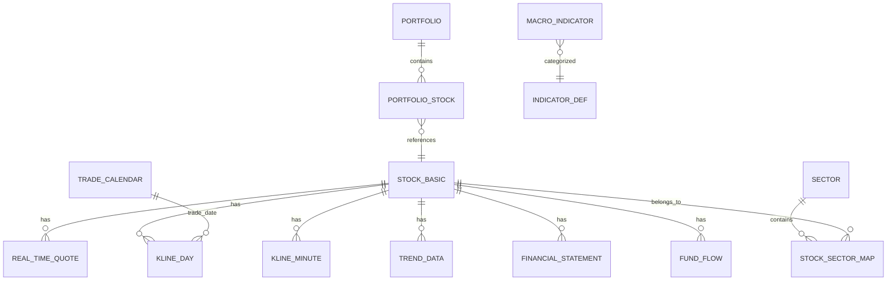

# 自选股分析工具 — 数据架构设计方案

> 基于国投证券（行情主干）+ 国信证券（财务/宏观补充）双数据源

---

## 一、技术选型

### 1.1 数据库：SQLite 3

| 考量 | 结论 |
|------|------|
| 个人工具、单用户 | ✅ SQLite 零部署 |
| 数据量：自选股 ≤ 200 只 | ✅ 日线 20年 ≈ 100万行，SQLite 轻松承载 |
| 是否需要网络服务 | ❌ 不需要，本地文件即可 |
| 是否需要并发写 | ❌ 单用户串行写入 |
| 查询复杂度 | ✅ 支持窗口函数、CTE、JSON 字段 |

**选型结论：SQLite 3（Python 内置，`sqlite3` 模块直接使用）**

### 1.2 应用层架构

```
┌─────────────────────────────────────────────────┐
│                   UI 层                          │
│     Streamlit / PyQt6 / Textual(TUI)            │
├─────────────────────────────────────────────────┤
│                Service 层                        │
│   PortfolioService / QuoteService / AnalysisSvc │
├──────────────────┬──────────────────────────────┤
│  DataSource 适配层 │     本地 Cache 层           │
│  ┌──────┬───────┐ │  ┌──────────────────────┐   │
│  │国投   │国信   │ │  │ SQLite + Redis-like  │   │
│  │API    │API    │ │  │ TTL 过期策略         │   │
│  └──────┴───────┘ │  └──────────────────────┘   │
├──────────────────┴──────────────────────────────┤
│                基础设施层                        │
│     httpx / pandas / python-dotenv               │
└─────────────────────────────────────────────────┘
```

### 1.3 数据流策略

| 数据类型 | 来源 | 刷新策略 | TTL |
|----------|------|----------|:---:|
| 股票基本信息 | 国投 `quote` | 首次/手动 | 长期缓存 |
| 实时行情 | 国投 `quote` | 每次打开/手动刷新 | 15秒 |
| 日K线 | 国投 `kline` | 每日收盘后/首次 | 1天 |
| 分钟K线/分时 | 国投 `trend`/`kline` | 盘中按需 | 实时 |
| 财务报表 | 国信 `financial` | 季报发布后 | 90天 |
| 宏观数据 | 国信 `economy` | 每月发布后 | 30天 |
| 资金流向 | 国信 `fund_flow` | 每日收盘后 | 1天 |
| 自选股列表 | 本地 SQLite | 用户操作 | 持久化 |

---

## 二、完整数据库表结构

### 2.1 ER 图



### 2.2 表定义

---

#### 表 1: `portfolio` — 自选股分组

```sql
CREATE TABLE portfolio (
    id          INTEGER PRIMARY KEY AUTOINCREMENT,
    name        TEXT    NOT NULL DEFAULT '默认分组',
    sort_order  INTEGER NOT NULL DEFAULT 0,
    created_at  TEXT    NOT NULL DEFAULT (datetime('now', 'localtime')),
    updated_at  TEXT    NOT NULL DEFAULT (datetime('now', 'localtime'))
);
```

#### 表 2: `portfolio_stock` — 自选股明细

```sql
CREATE TABLE portfolio_stock (
    id          INTEGER PRIMARY KEY AUTOINCREMENT,
    portfolio_id INTEGER NOT NULL REFERENCES portfolio(id) ON DELETE CASCADE,
    stock_code  TEXT    NOT NULL,       -- 如 'sh600519'
    market      TEXT    NOT NULL,       -- 'SH' / 'SZ' / 'BJ' / 'HK'
    note        TEXT,                    -- 用户备注
    sort_order  INTEGER NOT NULL DEFAULT 0,
    added_at    TEXT    NOT NULL DEFAULT (datetime('now', 'localtime')),
    UNIQUE(portfolio_id, stock_code)
);
CREATE INDEX idx_portfolio_stock_code ON portfolio_stock(stock_code);
```

#### 表 3: `stock_basic` — 股票基本信息（国投数据源）

```sql
CREATE TABLE stock_basic (
    stock_code      TEXT PRIMARY KEY,   -- 'sh600519'
    name            TEXT    NOT NULL,
    market          TEXT    NOT NULL,   -- 'SH' / 'SZ' / 'BJ' / 'HK'
    industry_code   TEXT,               -- 国投返回的行业代码
    industry_name   TEXT,               -- 国投返回的行业名称
    listing_date    TEXT,               -- 上市日期
    total_shares    REAL,               -- 总股本(亿)
    float_shares    REAL,               -- 流通股本(亿)
    is_active       INTEGER NOT NULL DEFAULT 1,  -- 是否仍在交易
    fetched_at      TEXT    NOT NULL DEFAULT (datetime('now', 'localtime')),
    UNIQUE(stock_code)
);
CREATE INDEX idx_stock_basic_industry ON stock_basic(industry_code);
```

#### 表 4: `real_time_quote` — 实时行情快照（国投数据源）

```sql
CREATE TABLE real_time_quote (
    id              INTEGER PRIMARY KEY AUTOINCREMENT,
    stock_code      TEXT    NOT NULL REFERENCES stock_basic(stock_code),
    -- 核心行情
    price           REAL    NOT NULL,   -- 当前价
    change          REAL    NOT NULL,   -- 涨跌额
    change_pct      TEXT    NOT NULL,   -- 涨跌幅(%)，如 '+2.35%'
    prev_close      REAL    NOT NULL,   -- 昨收
    open            REAL,               -- 今开
    high            REAL,               -- 最高
    low             REAL,               -- 最低
    avg_price       REAL,               -- 均价
    -- 量价
    volume          TEXT,               -- 成交量(手)
    amount          TEXT,               -- 成交额(元)
    turnover        TEXT,               -- 换手率(%)
    amplitude       TEXT,               -- 振幅(%)
    volume_ratio    REAL,               -- 量比
    -- 盘口
    outside         TEXT,               -- 外盘(手)
    inside          TEXT,               -- 内盘(手)
    -- 估值
    pe              REAL,               -- 市盈率
    pe_dynamic      REAL,               -- 动态市盈率
    pe_ttm          REAL,               -- 市盈率TTM
    market_value    TEXT,               -- 总市值
    circ_market_val TEXT,               -- 流通市值
    -- 多周期涨跌幅（国投特色字段）
    change_5d       TEXT,               -- 5日涨跌幅(%)
    change_20d      TEXT,               -- 20日涨跌幅(%)
    change_60d      TEXT,               -- 60日涨跌幅(%)
    change_120d     TEXT,               -- 120日涨跌幅(%)
    change_250d     TEXT,               -- 250日涨跌幅(%)
    change_ytd      TEXT,               -- 今年涨幅(%)
    change_month    TEXT,               -- 本月涨幅(%)
    change_week     TEXT,               -- 本周涨幅(%)
    -- ETF 专有
    iopv            TEXT,               -- IOPV净值
    discount_rate   TEXT,               -- 折价率
    fund_scale      TEXT,               -- 基金规模
    -- 元信息
    susp_flag       TEXT,               -- 停牌标志
    trade_date      TEXT    NOT NULL,   -- 交易日期 '2026-07-30'
    trade_time      TEXT    NOT NULL,   -- 交易时间 '14:30:00'
    fetched_at      TEXT    NOT NULL DEFAULT (datetime('now', 'localtime')),
    UNIQUE(stock_code, fetched_at)
);
CREATE INDEX idx_quote_stock_time ON real_time_quote(stock_code, fetched_at DESC);
```

#### 表 5: `kline_day` — 日K线（国投数据源）

```sql
CREATE TABLE kline_day (
    id          INTEGER PRIMARY KEY AUTOINCREMENT,
    stock_code  TEXT    NOT NULL REFERENCES stock_basic(stock_code),
    trade_date  TEXT    NOT NULL,       -- '2026-07-30'
    open        REAL    NOT NULL,
    high        REAL    NOT NULL,
    low         REAL    NOT NULL,
    close       REAL    NOT NULL,
    volume      INTEGER NOT NULL,       -- 成交量(股)
    amount      REAL,                   -- 成交额(元)
    UNIQUE(stock_code, trade_date)
);
CREATE INDEX idx_kline_day_code_date ON kline_day(stock_code, trade_date DESC);
```

#### 表 6: `kline_minute` — 分钟K线（国投数据源）

```sql
CREATE TABLE kline_minute (
    id          INTEGER PRIMARY KEY AUTOINCREMENT,
    stock_code  TEXT    NOT NULL REFERENCES stock_basic(stock_code),
    freq        TEXT    NOT NULL,       -- '1min' / '5min' / '15min' / '30min' / '60min'
    time_key    TEXT    NOT NULL,       -- '2026-07-30 09:35'
    open        REAL    NOT NULL,
    high        REAL    NOT NULL,
    low         REAL    NOT NULL,
    close       REAL    NOT NULL,
    volume      INTEGER NOT NULL,
    amount      REAL,
    UNIQUE(stock_code, freq, time_key)
);
CREATE INDEX idx_kline_minute_lookup ON kline_minute(stock_code, freq, time_key DESC);
```

#### 表 7: `trend_data` — 分时数据（国投数据源）

```sql
CREATE TABLE trend_data (
    id          INTEGER PRIMARY KEY AUTOINCREMENT,
    stock_code  TEXT    NOT NULL REFERENCES stock_basic(stock_code),
    trade_date  TEXT    NOT NULL,
    time_seq    INTEGER NOT NULL,       -- 1-241 分时序号
    price       REAL    NOT NULL,
    avg_price   REAL,
    volume      INTEGER NOT NULL,
    change      REAL,
    change_pct  TEXT,
    UNIQUE(stock_code, trade_date, time_seq)
);
CREATE INDEX idx_trend_lookup ON trend_data(stock_code, trade_date, time_seq);
```

#### 表 8: `financial_statement` — 财务报表（国信数据源）

```sql
CREATE TABLE financial_statement (
    id          INTEGER PRIMARY KEY AUTOINCREMENT,
    stock_code  TEXT    NOT NULL REFERENCES stock_basic(stock_code),
    market      TEXT    NOT NULL,       -- 'SH' / 'SZ' / 'HK'
    report_type TEXT    NOT NULL,       -- 'Q1' / 'Q2' / 'Q3' / 'Q4'(年报)
    report_year TEXT    NOT NULL,       -- '2024'
    report_date TEXT,                   -- 报告日期 '2024-12-31'
    -- 利润表关键字段
    revenue     REAL,                   -- 营业总收入
    cost        REAL,                   -- 营业总成本
    gross_profit REAL,                  -- 毛利润 (自动计算字段)
    net_profit  REAL,                   -- 净利润
    non_gaap_net REAL,                  -- 扣非净利润
    eps         REAL,                   -- 每股收益
    gross_margin REAL,                  -- 毛利率(%)
    net_margin  REAL,                   -- 净利率(%)
    -- 资产负债表关键字段
    total_assets    REAL,               -- 总资产
    current_assets  REAL,               -- 流动资产
    total_liab      REAL,               -- 总负债
    current_liab    REAL,               -- 流动负债
    equity          REAL,               -- 股东权益
    -- 现金流量表关键字段
    oper_cf     REAL,                   -- 经营活动现金流净额
    invest_cf   REAL,                   -- 投资活动现金流净额
    finance_cf  REAL,                   -- 筹资活动现金流净额
    free_cf     REAL,                   -- 自由现金流 (自动计算)
    -- 衍生指标
    roe             REAL,               -- ROE(%)
    roa             REAL,               -- ROA(%)
    debt_ratio      REAL,               -- 资产负债率(%)
    revenue_growth  REAL,               -- 营收同比增速(%)
    profit_growth   REAL,               -- 净利润同比增速(%)
    -- 元信息
    currency    TEXT NOT NULL DEFAULT 'CNY',
    fetched_at  TEXT NOT NULL DEFAULT (datetime('now', 'localtime')),
    UNIQUE(stock_code, report_type, report_year)
);
CREATE INDEX idx_fin_stmt_lookup ON financial_statement(stock_code, report_year DESC, report_type);
```

#### 表 9: `fund_flow` — 资金流向（国信数据源）

```sql
CREATE TABLE fund_flow (
    id              INTEGER PRIMARY KEY AUTOINCREMENT,
    stock_code      TEXT    NOT NULL REFERENCES stock_basic(stock_code),
    trade_date      TEXT    NOT NULL,
    -- 主力资金（国信 moneyflow 接口）
    main_force_net  REAL,               -- 主力净额(元)
    super_large_buy REAL,               -- 超大单买入
    super_large_sell REAL,              -- 超大单卖出
    large_buy       REAL,               -- 大单买入
    large_sell      REAL,               -- 大单卖出
    medium_buy      REAL,               -- 中单买入
    medium_sell     REAL,               -- 中单卖出
    small_buy       REAL,               -- 小单买入
    small_sell      REAL,               -- 小单卖出
    fetched_at      TEXT NOT NULL DEFAULT (datetime('now', 'localtime')),
    UNIQUE(stock_code, trade_date)
);
CREATE INDEX idx_fund_flow_date ON fund_flow(stock_code, trade_date DESC);
```

#### 表 10: `macro_indicator` — 宏观经济数据（国信数据源）

```sql
CREATE TABLE macro_indicator (
    id          INTEGER PRIMARY KEY AUTOINCREMENT,
    indicator_code TEXT NOT NULL,       -- 'GDP_CN' / 'CPI_CN' / 'M2_CN' / 'PMI_CN' / 'LPR_1Y' ...
    indicator_name TEXT NOT NULL,       -- '中国GDP同比增速'
    region      TEXT NOT NULL,          -- 'CN' / 'US' / 'EU' / 'JP'
    freq        TEXT NOT NULL,          -- 'Y' / 'Q' / 'M' / 'W' / 'D'
    period      TEXT NOT NULL,          -- '2024Q4' / '2025-06' / '2025'
    value       REAL,                   -- 指标值
    unit        TEXT,                   -- '%' / '亿元' / '亿美元'
    yoy_change  REAL,                   -- 同比变化
    mom_change  REAL,                   -- 环比变化
    fetched_at  TEXT NOT NULL DEFAULT (datetime('now', 'localtime')),
    UNIQUE(indicator_code, period)
);
CREATE INDEX idx_macro_region ON macro_indicator(region, indicator_code, period DESC);
CREATE INDEX idx_macro_code   ON macro_indicator(indicator_code, period DESC);
```

#### 表 11: `indicator_def` — 指标字典

```sql
CREATE TABLE indicator_def (
    code        TEXT PRIMARY KEY,       -- 'GDP_CN'
    name        TEXT NOT NULL,          -- '中国GDP同比增速'
    category    TEXT NOT NULL,          -- '国民核算' / '价格指数' / '货币金融' / '财政收支' / '产业运行' / '国际宏观'
    region      TEXT NOT NULL,
    unit        TEXT,                   -- '%'
    description TEXT,
    source      TEXT NOT NULL DEFAULT '国信证券'
);
```

#### 表 12: `sector_crowding` — 行业拥挤度（国投数据源）

```sql
CREATE TABLE sector_crowding (
    id              INTEGER PRIMARY KEY AUTOINCREMENT,
    sector_code     TEXT NOT NULL,      -- 行业指数代码
    sector_name     TEXT NOT NULL,      -- '半导体' / '医药'
    calc_date       TEXT NOT NULL,      -- 计算日期
    -- 5日维度
    d5_amount_max   REAL,
    d5_amount_now   REAL,
    d5_amount_quantile REAL,
    d5_market_val_max   REAL,
    d5_market_val_now   REAL,
    d5_market_val_quantile REAL,
    d5_turnover_max REAL,
    d5_turnover_now REAL,
    d5_turnover_quantile REAL,
    -- 20日维度
    d20_amount_max   REAL,
    d20_amount_now   REAL,
    d20_amount_quantile REAL,
    d20_market_val_max   REAL,
    d20_market_val_now   REAL,
    d20_market_val_quantile REAL,
    d20_turnover_max REAL,
    d20_turnover_now REAL,
    d20_turnover_quantile REAL,
    fetched_at      TEXT NOT NULL DEFAULT (datetime('now', 'localtime')),
    UNIQUE(sector_code, calc_date)
);
```

#### 表 13: `sector` — 行业板块字典

```sql
CREATE TABLE sector (
    code        TEXT PRIMARY KEY,       -- 行业代码
    name        TEXT NOT NULL,          -- '半导体'
    category    TEXT NOT NULL,          -- 'industry' / 'concept' / 'region'
    level       INTEGER DEFAULT 1      -- 行业层级
);
```

#### 表 14: `stock_sector_map` — 股票行业归属

```sql
CREATE TABLE stock_sector_map (
    stock_code  TEXT NOT NULL REFERENCES stock_basic(stock_code),
    sector_code TEXT NOT NULL REFERENCES sector(code),
    PRIMARY KEY (stock_code, sector_code)
);
```

#### 表 15: `trade_calendar` — 交易日历

```sql
CREATE TABLE trade_calendar (
    trade_date  TEXT PRIMARY KEY,       -- '2026-07-30'
    market      TEXT NOT NULL DEFAULT 'SH',  -- 'SH' / 'SZ' / 'HK'
    is_open     INTEGER NOT NULL DEFAULT 1,  -- 1交易日 0休市
    day_type    TEXT                    -- '交易日' / '周末' / '节假日'
);
CREATE INDEX idx_cal_date ON trade_calendar(trade_date);
```

#### 表 16: `cache_meta` — 缓存元信息

```sql
CREATE TABLE cache_meta (
    cache_key   TEXT PRIMARY KEY,       -- 'kline:sh600519:day' / 'quote:batch'
    data_source TEXT NOT NULL,          -- 'sdicsc' / 'gs'
    fetched_at  TEXT NOT NULL,
    expires_at  TEXT NOT NULL,
    data_hash   TEXT,                   -- 数据指纹，用于判断是否变更
    row_count   INTEGER
);
CREATE INDEX idx_cache_expires ON cache_meta(expires_at);
```

---

## 三、数据源适配层设计

### 3.1 适配器接口（Python Protocol）

```python
from typing import Protocol, Optional, List
from datetime import date

class StockDataSource(Protocol):
    """行情数据源抽象接口"""
    
    def get_quote(self, code: str) -> dict: ...
    def get_batch_quote(self, codes: List[str]) -> List[dict]: ...
    def get_kline(self, code: str, ktype: str = 'day', 
                  count: int = 100) -> List[dict]: ...
    def get_trend(self, code: str) -> dict: ...
    def get_rank(self, sort: str, market: str, count: int) -> List[dict]: ...

class FinancialDataSource(Protocol):
    """财务数据源抽象接口"""
    
    def get_income_stmt(self, code: str, market: str, 
                        report_type: str = 'Q0') -> dict: ...
    def get_balance_sheet(self, code: str, market: str,
                          report_type: str = 'Q0') -> dict: ...
    def get_cash_flow(self, code: str, market: str,
                      report_type: str = 'Q0') -> dict: ...

class MacroDataSource(Protocol):
    """宏观数据源抽象接口"""
    
    def query_macro(self, query: str) -> str: ...
```

### 3.2 数据源注册与路由

```python
from dataclasses import dataclass

@dataclass
class DataSourceConfig:
    """数据源配置"""
    name: str                    # 'sdicsc' / 'gs'
    api_key_env: str             # 环境变量名
    base_url: str                # API端点
    priority: int = 0            # 优先级，数字越小越优先

# 注册中心
DATA_SOURCES = {
    'quote':   DataSourceConfig('sdicsc', 'GT_ZNXG_KEY', 'https://skills.sdicsc.com.cn/skill/hq', priority=1),
    'kline':   DataSourceConfig('sdicsc', 'GT_ZNXG_KEY', 'https://skills.sdicsc.com.cn/skill/hq', priority=1),
    'trend':   DataSourceConfig('sdicsc', 'GT_ZNXG_KEY', 'https://skills.sdicsc.com.cn/skill/hq', priority=1),
    'finance': DataSourceConfig('gs',     'GS_API_KEY',  'https://dgzt.guosen.com.cn/skills', priority=2),
    'macro':   DataSourceConfig('gs',     'GS_API_KEY',  'https://dgzt.guosen.com.cn/skills', priority=2),
    'flow':    DataSourceConfig('gs',     'GS_API_KEY',  'https://dgzt.guosen.com.cn/skills', priority=2),
}
```

---

## 四、索引策略总览

| 表 | 索引 | 查询场景 |
|:---|:-----|:---------|
| `portfolio_stock` | `(stock_code)` | 按股票查它在哪些分组 |
| `stock_basic` | `(industry_code)` | 按行业筛选股票 |
| `real_time_quote` | `(stock_code, fetched_at DESC)` | 获取某只股票最新行情 |
| `kline_day` | `(stock_code, trade_date DESC)` | 查日K线序列 |
| `kline_minute` | `(stock_code, freq, time_key DESC)` | 查分钟K线序列 |
| `trend_data` | `(stock_code, trade_date, time_seq)` | 查某日分时 |
| `financial_statement` | `(stock_code, report_year DESC, report_type)` | 查最新财报 |
| `fund_flow` | `(stock_code, trade_date DESC)` | 查最新资金流向 |
| `macro_indicator` | `(indicator_code, period DESC)` | 查某指标时间序列 |
| `sector_crowding` | `(sector_code, calc_date DESC)` | 查某行业最新拥挤度 |
| `cache_meta` | `(expires_at)` | 清理过期缓存 |

---

## 五、典型查询场景

### 5.1 自选股仪表盘（一次查询全部）

```sql
-- 获取分组 + 最新行情
SELECT 
    p.name AS group_name,
    ps.stock_code,
    sb.name AS stock_name,
    sb.industry_name,
    q.price,
    q.change,
    q.change_pct,
    q.pe_ttm,
    q.market_value,
    q.change_20d,
    q.turnover,
    q.susp_flag
FROM portfolio p
JOIN portfolio_stock ps ON p.id = ps.portfolio_id
JOIN stock_basic sb ON ps.stock_code = sb.stock_code
LEFT JOIN real_time_quote q ON q.stock_code = ps.stock_code
WHERE q.fetched_at = (SELECT MAX(fetched_at) FROM real_time_quote)
ORDER BY p.sort_order, ps.sort_order;
```

### 5.2 K线 + 移动均线计算

```sql
-- 计算 MA5, MA20, MA60
SELECT 
    trade_date,
    close,
    AVG(close) OVER (ORDER BY trade_date ROWS 4 PRECEDING) AS ma5,
    AVG(close) OVER (ORDER BY trade_date ROWS 19 PRECEDING) AS ma20,
    AVG(close) OVER (ORDER BY trade_date ROWS 59 PRECEDING) AS ma60
FROM kline_day
WHERE stock_code = 'sh600519'
ORDER BY trade_date DESC
LIMIT 120;
```

### 5.3 财务分析卡片

```sql
-- 最新财报关键指标
SELECT 
    fs.report_year,
    fs.report_type,
    fs.revenue,
    fs.net_profit,
    fs.gross_margin,
    fs.net_margin,
    fs.roe,
    fs.debt_ratio,
    fs.revenue_growth,
    fs.profit_growth
FROM financial_statement fs
WHERE fs.stock_code = 'sh600519'
ORDER BY fs.report_year DESC, fs.report_type
LIMIT 4;
```

---

## 六、技术栈推荐

| 层级 | 选型 | 理由 |
|:-----|:-----|:-----|
| **数据库** | SQLite 3 | 零配置，Python 内置，够用 |
| **ORM/查询** | 裸 `sqlite3` + `pandas` 读分析 | 轻量，无需 SQLAlchemy |
| **API 客户端** | `httpx`（异步） | 同时请求多只行情 |
| **数据缓存** | 内置 `cache_meta` 表 + TTL | 避免重复拉取 |
| **UI 框架** | **Streamlit** | 原型快，内置表格/图表 |
| **备选 UI** | **Textual** | 终端 TUI，无 GUI 依赖 |
| **图表** | `plotly` | 交互式K线图 |
| **定时任务** | `schedule` + 后台线程 | 盘后自动拉取数据 |
| **配置管理** | `python-dotenv` | API Key 不硬编码 |

---

## 七、数据流全景图

```
用户操作（添加自选股）
    │
    ▼
PortfolioService.add_stock('sh600519')
    │
    ├──▶ 写入 portfolio_stock 表
    │
    ▼
首次加载：
    QuoteService.refresh(['sh600519', 'sh000001'])
    │
    ├──▶ CacheMeta 检查是否过期
    ├──▶ 过期 → DataSourceRouter('quote').get_batch_quote(codes)
    │       │
    │       └──▶ POST https://skills.sdicsc.com.cn/skill/hq/api/quote/batch
    │               │
    │               └──▶ 写入 real_time_quote 表
    │
    ├──▶ DataSourceRouter('kline').get_kline('sh600519', 'day', 120)
    │       │
    │       └──▶ GET  .../api/kline/sh600519?type=day&count=120
    │               │
    │               └──▶ 写入 kline_day 表
    │
    ▼
盘后更新（定时任务）：
    DailySyncJob
    ├──▶ 拉取日K线（补齐）
    ├──▶ 拉取资金流向（国信）
    ├──▶ 拉取财务报表（国信，季报后）
    └──▶ 拉取宏观数据（国信，月度）
```

---

## 八、部署形态

```
项目目录结构：
stock-analyzer/
├── data/
│   └── stock.db              # SQLite 数据库文件
├── src/
│   ├── main.py               # 入口（Streamlit / TUI）
│   ├── db/
│   │   ├── schema.py         # 建表 DDL
│   │   ├── connection.py     # 连接管理
│   │   └── migrations.py     # 增量迁移
│   ├── datasource/
│   │   ├── router.py         # 数据源路由
│   │   ├── sdicsc_client.py  # 国投证券 HTTP 客户端
│   │   └── gs_client.py      # 国信证券 HTTP 客户端
│   ├── service/
│   │   ├── portfolio.py      # 自选股管理
│   │   ├── quote.py          # 行情服务
│   │   ├── kline.py          # K线服务
│   │   ├── financial.py      # 财务服务
│   │   ├── macro.py          # 宏观服务
│   │   └── sync.py           # 定时同步
│   ├── model/
│   │   └── types.py          # 数据类定义
│   └── cache/
│       └── cache_manager.py  # TTL 缓存管理
├── config/
│   └── .env                  # API Key 配置
├── requirements.txt
└── README.md
```
